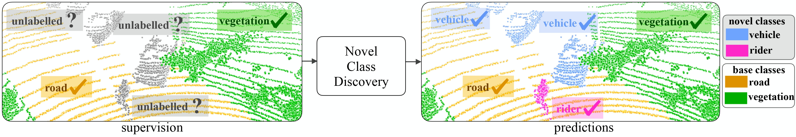

# **Novel Class Discovery for 3D Point Cloud Semantic Segmentation [CVPR 2023]**
The official implementation of our work "Novel Class Discovery for 3D Point Cloud Semantic Segmentation".



## Introduction
Novel class discovery (NCD) for semantic segmentation is the problem of learning a model that is capable of segmenting unlabelled (novel) classes by using only the supervision from labelled (base) classes.
This problem has been recently pioneered for 2D image data, but no work exists for 3D point cloud data.
In fact, assumptions made for 2D are loosely applicable to 3D in this case.
This paper is thus presented to advance the state of the art on point cloud data analysis in four directions.
Firstly, we address the new problem of NCD for point cloud semantic segmentation.
Secondly, we show that the transposition of the only existing NCD method for 2D semantic segmentation to 3D data is suboptimal.
Thirdly, we present a new method for NCD based on online clustering that exploits uncertainty quantification to produce prototypes for pseudo-labelling the points of the novel classes.
Lastly, we introduce a new evaluation protocol to assess the performance of NCD for point cloud semantic segmentation.
We thoroughly evaluate our method on SemanticKITTI and SemanticPOSS datasets, showing that it can significantly outperform the baseline.

:fire: For more information have a look at our [PAPER](https://arxiv.org/pdf/2303.11610)! :fire:

Authors: 
        [Luigi Riz](https://scholar.google.com/citations?user=djO2pVUAAAAJ&hl),
        [Cristiano Saltori](https://scholar.google.com/citations?user=PID7Z4oAAAAJ&hl),
        [Elisa Ricci](https://scholar.google.ca/citations?user=xf1T870AAAAJ&hl),
        [Fabio Poiesi](https://scholar.google.co.uk/citations?user=BQ7li6AAAAAJ&hl)

## News :new:
- 3/2023: NOPS code is **OUT**!:fire:
- 3/2023: NOPS is accepted to CVPR 2023!:fire: Our work is the first allowing the segmentation of known and unknown classes in 3D Lidar scans!

## Installation

The code has been tested with Python 3.8, CUDA 11.3, pytorch 1.10.1 and pytorch-lighting 1.4.8. Any other version may require to update the code for compatibility.

### Conda
To run the code, you need to install:
- [Pytorch 1.10.1](https://pytorch.org/get-started/previous-versions/)
- [Minkowski Engine](https://github.com/NVIDIA/MinkowskiEngine)
- [Pytorch-Lighting 1.4.8](https://www.pytorchlightning.ai) (be sure to install torchmetrics=0.7.2)
- [Scipy 1.7.3](https://scipy.org/install/)
- [Wandb](https://docs.wandb.ai/quickstart)

## Data preparation
To download the data follow the instructions provided by [SemanticKITTI](http://www.semantic-kitti.org) and [SemanticPOSS](http://www.poss.pku.edu.cn/semanticposs.html). Then, use this structure of the folders:
```
./
├── 
├── ...
└── path_to_data_shown_in_yaml_config/
      └── sequences
            ├── 00/           
            │   ├── velodyne/	
            |   |	   ├── 000000.bin
            |   |	   ├── 000001.bin
            |   |	   └── ...
            │   └── labels/ 
            |          ├── 000000.label
            |          ├── 000001.label
            |          └── ...
            └── ...
```

## Commands
### Pretraining
To run the pretraining:
```
python main_pretrain.py -s [SPLIT NUMBER] --dataset [SemanticPOSS, SemanticKITTI]
```
For additional command line arguments, run:
```
python main_pretrain.py -h
```

### Discovery
To run the discovery step (pretraining is not mandatory):
```
python main_discover.py -s [SPLIT NUMBER] --dataset [SemanticPOSS, SemanticKITTI]
```
For additional command line arguments, run:
```
python main_discover.py -h
```
To reproduce the paper results run:
```
python main_discover.py -s [SPLIT NUMBER] --dataset SemanticPOSS --dataset_config [CONFIG_PATH] --num_heads=5 --overcluster_factor=3 --use_scheduler --adapting_epsilon_sk --use_uncertainty_queue --use_uncertainty_loss --uncertainty_percentile=0.3
```
```
python main_discover.py -s [SPLIT NUMBER] --dataset SemanticKITTI --dataset_config [CONFIG_PATH] --num_heads=5 --overcluster_factor=3 --use_scheduler --adapting_epsilon_sk --use_uncertainty_queue --use_uncertainty_loss --uncertainty_percentile=0.5
```

To test with a checkpoint, run:
```
python main_discover_test.py -s [SPLIT NUMBER] --checkpoint=[PATH TO LIGHTNING CHECKPOINT]
```

## Citing our work

Please cite the following paper if you use our code:

```latex
@inproceedings{riz2023novel,
  author={Riz, Luigi and Saltori, Cristiano and Ricci, Elisa and Poiesi, Fabio},
  booktitle={2023 IEEE/CVF Conference on Computer Vision and Pattern Recognition (CVPR)}, 
  title={Novel Class Discovery for 3D Point Cloud Semantic Segmentation}, 
  year={2023},
  volume={},
  number={},
  pages={9393-9402},
  doi={10.1109/CVPR52729.2023.00906}}
```

## Acknowledgements

This project has received funding from the European Union’s Horizon Europe research and innovation programme under grant agreement No 101058589.
This work was also partially supported by the PRIN project LEGO-AI (Prot. 2020TA3K9N), the EU ISFP PROTECTOR (101034216) project and the EU H2020 MARVEL (957337) project and, it was carried out in the Vision and Learning joint laboratory of Fondazione Bruno Kessler and UNITN.

## TODOS :soon:
- Add code for $\text{EUMS}^\dagger$
